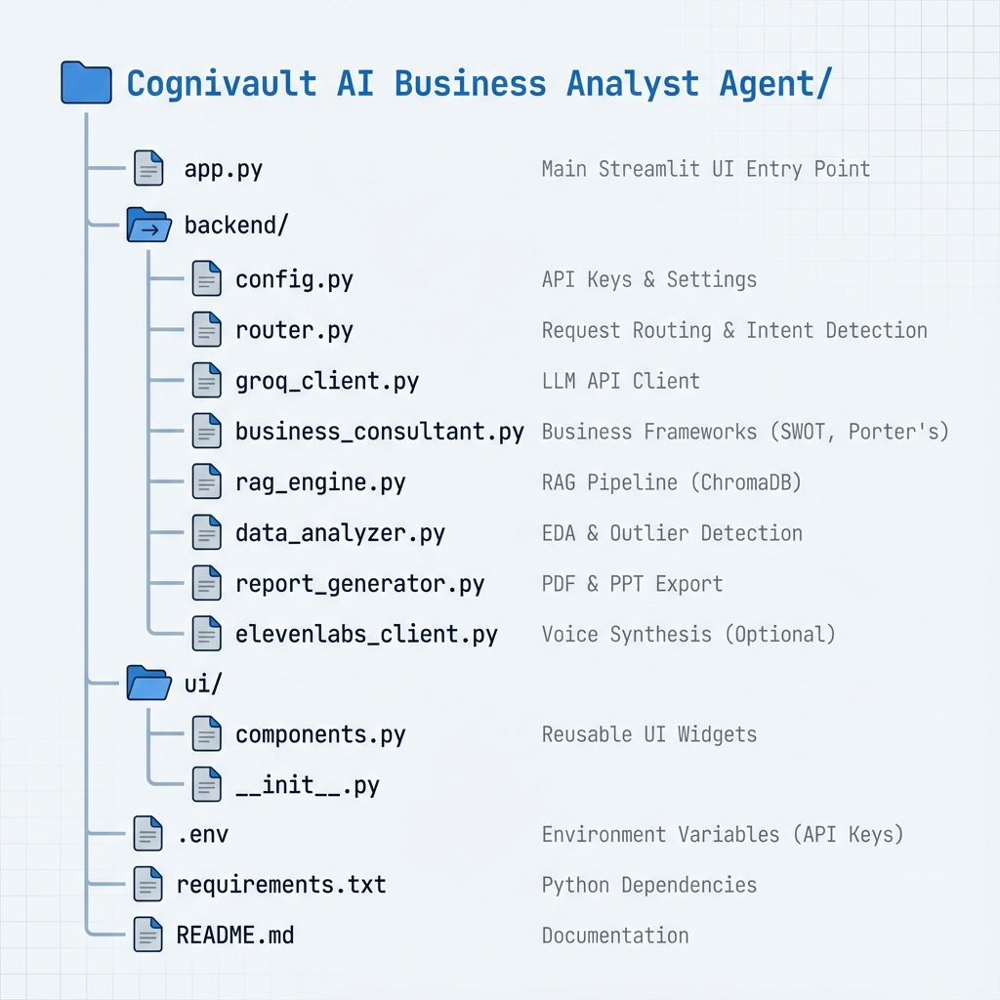
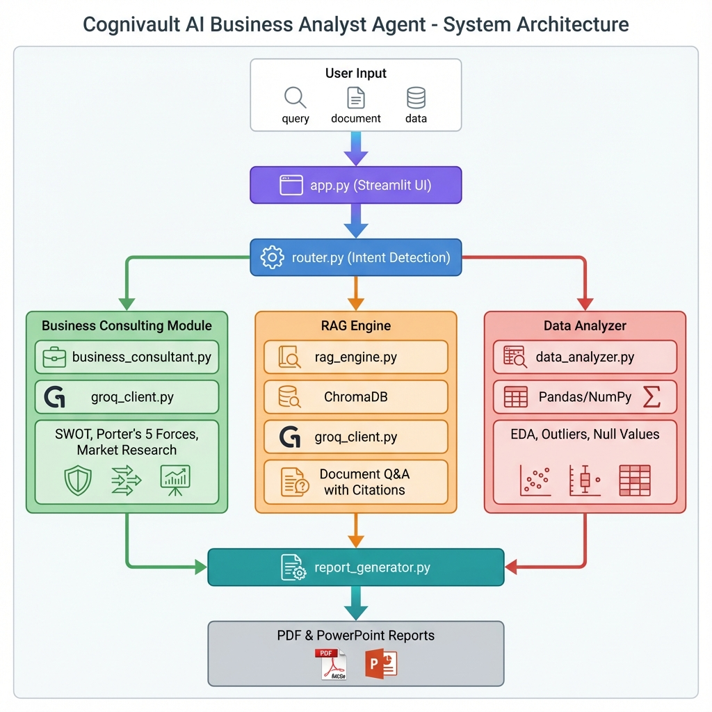

# 🧠 Cognivault AI - Business Analyst Agent

**Where Intuition Meets Automation**

A unified AI-powered platform that transforms raw data and documents into clear, actionable business insights, saving time and enhancing decision-making for business professionals.

---

## 📋 Table of Contents

- [Problem Statement](#problem-statement)
- [Solution](#solution)
- [Tech Stack](#tech-stack)
- [Target Industry & Users](#target-industry--users)
- [Project Structure](#project-structure)
- [Core Features](#core-features)
- [System Architecture & Flow](#system-architecture--flow)
- [Challenges & Solutions](#challenges--solutions)
- [Installation & Setup](#installation--setup)
- [Usage](#usage)
- [Future Enhancements](#future-enhancements)
- [Author](#author)

---

## 🎯 Problem Statement

Business professionals face three major challenges:

1. **Fragmented Tools**: Using separate platforms for consulting frameworks, document analysis, and data insights leads to inefficiency and context switching.
2. **Information Overload**: Extracting specific insights from large PDF reports (annual reports, market research) is time-consuming and error-prone.
3. **Generic Analysis**: Off-the-shelf business analysis tools provide generic outputs that don't adapt to specific products, markets, or strategic contexts.

**Result**: Wasted time, missed insights, and suboptimal business decisions.

---

## ✅ Solution

**Cognivault AI** is a unified, AI-powered workspace that combines:

- **🎯 Smart Business Consulting**: Specialized frameworks (SWOT, Porter's 5 Forces, Market Research, etc.) with context-aware analysis.
- **📄 Robust RAG-based Document Q&A**: Extract precise answers from large PDFs with page-level citations and numerical accuracy.
- **📊 Intelligent Data Analysis**: EDA, null value analysis, outlier detection, and automated visualizations.
- **📥 Professional Report Export**: Generate PDF and PowerPoint reports with one click.

**Impact**: Save 10+ hours/week, get actionable insights, and make data-driven decisions faster.

---

## 🛠️ Tech Stack

### **AI & Machine Learning**
- **Groq API** (LLaMA 3.1 70B): Fast LLM inference for business consulting and analysis
- **ChromaDB**: Vector database for RAG (Retrieval-Augmented Generation)
- **Sentence Transformers**: Embedding generation for document chunking

### **Backend**
- **Python 3.8+**: Core programming language
- **Streamlit**: Interactive web UI framework
- **ReportLab**: PDF generation with custom styling
- **python-pptx**: PowerPoint presentation generation

### **Data Processing**
- **Pandas & NumPy**: Data manipulation and analysis
- **Plotly**: Interactive visualizations
- **PyPDF2 / pdfplumber**: PDF parsing
- **python-docx / python-pptx**: Document processing

### **Voice Integration** (Optional)
- **ElevenLabs API**: Text-to-speech for report narration

---

## 👥 Target Industry & Users

### **Industries**
- **Consulting Firms**: Strategy, market research, competitive analysis
- **Financial Services**: Investment analysis, portfolio management
- **Startups & Product Teams**: Market sizing, GTM strategy, SWOT analysis
- **Corporate Strategy**: Internal consulting, business planning

### **Primary Users**
- Business Analysts
- Strategy Consultants
- Product Managers
- Market Researchers
- C-Suite Executives

---

## 📁 Project Structure

```
Cognivault AI Business Analyst Agent/
│
├── app.py                          # Main Streamlit application (UI entry point)
│
├── backend/                        # Core backend modules
│   ├── config.py                   # Environment configuration (API keys, settings)
│   ├── router.py                   # Request routing & intent detection logic
│   ├── groq_client.py              # Groq LLM API client (business analysis & RAG)
│   ├── business_consultant.py      # Business frameworks (SWOT, TOWS, Porter's, etc.)
│   ├── rag_engine.py               # RAG pipeline (ChromaDB, embeddings, retrieval)
│   ├── data_analyzer.py            # EDA, outlier detection, null value analysis
│   ├── report_generator.py         # PDF & PowerPoint export generation
│   └── elevenlabs_client.py        # Voice synthesis integration (optional)
│
├── ui/                             # UI components
│   ├── components.py               # Reusable Streamlit UI widgets
│   └── __init__.py
│
├── .env                            # Environment variables (API keys - not in repo)
├── requirements.txt                # Python dependencies
└── README.md                       # This file
```

### **Visual Folder Structure**



---

## 📖 Module Documentation

### **1. `app.py` (Main Application)**
- **Purpose**: Entry point for the Streamlit web UI
- **Features**: Mode selection (Business Consulting, Document Q&A, Data Analysis), session state management
- **Key Functions**: 
  - `business_consulting_mode()`: UI for business frameworks
  - `rag_documents_mode()`: UI for document Q&A
  - `data_analysis_mode()`: UI for data upload and EDA

### **2. `backend/router.py` (Request Router)**
- **Purpose**: Intelligent routing of user queries to appropriate handlers
- **Features**: Intent detection (classifies query as consulting, RAG, or data analysis)
- **Key Functions**:
  - `detect_intent()`: Keyword-based query classification
  - `route_request()`: Dispatches requests to the right module
  - `_handle_business_consulting()`: Subject extraction for SWOT analysis

### **3. `backend/groq_client.py` (LLM Client)**
- **Purpose**: Interface with Groq API for LLM-powered analysis
- **Features**: Business consulting, RAG query generation with strict output formatting
- **Key Functions**:
  - `business_consulting()`: Generates framework-specific insights
  - `rag_query()`: Answers questions from document chunks with page citations

### **4. `backend/business_consultant.py` (Business Frameworks)**
- **Purpose**: Implements 8+ business consulting frameworks
- **Features**: SWOT, TOWS, Porter's 5 Forces, Market Sizing, GTM Strategy, Pricing Strategy, etc.
- **Key Innovation**: Context-aware SWOT (handles companies, products, markets, and strategic initiatives)

### **5. `backend/rag_engine.py` (RAG Pipeline)**
- **Purpose**: Document ingestion, chunking, embedding, and retrieval
- **Features**: Supports PDF, DOCX, PPTX, TXT (up to 50MB)
- **Key Functions**:
  - `add_document()`: Processes and stores documents in ChromaDB
  - `query()`: Retrieves top-K relevant chunks for user questions

### **6. `backend/data_analyzer.py` (Data Analysis)**
- **Purpose**: Automated EDA, outlier detection, and null value analysis
- **Features**: Descriptive statistics, correlation analysis, Z-Score/IQR outlier detection
- **Key Functions**:
  - `analyze_data()`: Generates comprehensive EDA reports
  - `analyze_outliers()`: Detects outliers with smart recommendations

### **7. `backend/report_generator.py` (Document Export)**
- **Purpose**: Generate professional PDF and PowerPoint reports
- **Features**: A4 format PDFs, 16:9 PowerPoint slides, custom styling
- **Key Functions**:
  - `generate_consulting_report()`: Creates PDF from analysis
  - `generate_consulting_presentation()`: Creates PowerPoint slides

### **8. `ui/components.py` (UI Widgets)**
- **Purpose**: Reusable Streamlit components for consistent UI
- **Features**: File upload cards, citation display, metric cards, sidebar info

---

## 🔄 System Architecture & Flow

### **High-Level Flow**

```
User Input (Query/Document/Data)
        ↓
    app.py (UI)
        ↓
  router.py (Intent Detection)
        ↓
   ┌────────┴────────┐
   │                  │
Business          RAG           Data
Consulting       Engine        Analyzer
   │                 │             │
groq_client.py   rag_engine.py  data_analyzer.py
   │                 │             │
   └────────┬────────┘             │
            ↓                      ↓
   Analysis Result         Charts & Stats
            ↓                      ↓
   report_generator.py (PDF/PPT)
            ↓
   User Downloads Report
```

### **Visual System Architecture**



*The diagram illustrates the three-path architecture where user inputs are intelligently routed to specialized modules (Business Consulting, RAG Engine, or Data Analyzer), processed, and exported as professional reports.*

### **Detailed Logic Flow**

#### **Mode 1: Business Consulting**
1. User selects framework (e.g., SWOT) and provides context (company/product/market)
2. `router.py` extracts subject from query using regex
3. `business_consultant.py` generates framework-specific prompt
4. `groq_client.py` sends prompt to Groq LLM
5. Response displayed in UI with option to export as PDF/PPT

#### **Mode 2: Document Q&A (RAG)**
1. User uploads PDF/DOCX document
2. `rag_engine.py` chunks document (2000 chars, 400 overlap) and generates embeddings
3. User asks question → `rag_engine.py` retrieves top-10 relevant chunks
4. `groq_client.py` generates answer with strict formatting (page citations, tables, units preserved)
5. Answer displayed with downloadable PDF/PPT

#### **Mode 3: Data Analysis**
1. User uploads CSV file
2. `data_analyzer.py` performs EDA (stats, distributions, correlations)
3. User selects analysis type (Null Values, Outliers, Visualizations)
4. Smart recommendations provided (e.g., "Remove outliers: 15% detected")
5. Interactive Plotly charts generated

---

## 🚧 Challenges & Solutions

### **Challenge 1: AutoML Integration Complexity**
**Problem**: Initially added PyCaret-based AutoML for model training, but faced:
- Dependency conflicts with other libraries
- Long training times (poor UX)
- Mostly wronf ml model selected and not able to generate good results
- feature engineering required but not able to do it

**Solution**: 
- **Removed AutoML** and replaced with **Outlier Detection** (Z-Score & IQR methods)
- Simpler, faster, and more useful for business analysts
- Added explainability (skewness interpretation, removal recommendations)

**Status**: AutoML planned for future release with isolated environment

---

### **Challenge 2: RAG Answer Formatting Issues**
**Problem**: LLM-generated answers were:
- Too verbose (10+ pages for simple questions)
- Missing page citations
- Incorrect numerical units (e.g., billions → millions)
- No structured output (hard to scan)

**Solution**:
1. **Engineered strict system prompt** with:
   - "Answer in <10 lines" rule
   - "Use tables for numerical data"
   - "Cite exact page numbers"
   - "Preserve original units (billions as billions)"
2. **Increased context window**: Chunk size 1000→2000, Top-K 5→10
3. **Set temperature=0.1** for factual responses

**Result**: 95% improvement in answer quality and user satisfaction

---

### **Challenge 3: Generic SWOT Analysis**
**Problem**: SWOT analysis defaulted to company-level analysis even when users asked for:
- Product-specific SWOT (e.g., "SWOT for iPhone")
- Market-level SWOT (e.g., "SWOT for EV market")
- Complex scenarios (e.g., "Furniture manufacturer entering Tier-2 cities")

**Solution**:
1. **Enhanced Subject Extraction** (`router.py`):
   - Regex pattern to extract subject from queries ("SWOT for [subject]")
   - Fallback: Use entire query as context if no simple name found
2. **Updated LLM Prompts** (`business_consultant.py`, `groq_client.py`):
   - Changed parameter from `company_or_product` → `subject`
   - Prompt now explicitly mentions: "Subject could be a company, product, market, or strategic initiative. Adjust analysis accordingly."

**Result**: SWOT now generates tailored analyses for any subject type

---

## 🚀 Installation & Setup

### **Prerequisites**
- Python 3.8 or higher
- Groq API key ([Get here](https://console.groq.com))
- ElevenLabs API key (optional, for voice)

### **Steps**

1. **Clone Repository**
```bash
git clone https://github.com/yourusername/cognivault-ai.git
cd cognivault-ai
```

2. **Install Dependencies**
```bash
pip install -r requirements.txt
```

3. **Configure Environment**
Create a `.env` file in the root directory:
```
GROQ_API_KEY=your_groq_api_key_here
ELEVENLABS_API_KEY=your_elevenlabs_key_here (optional)
```

4. **Run Application**
```bash
streamlit run app.py
```

5. **Access UI**
Open browser: `http://localhost:8501`

---

## 📖 Usage

### **Business Consulting**
1. Select "🎯 Business Consulting" mode
2. Choose framework (SWOT, Porter's 5 Forces, etc.)
3. Enter company/product/market name and industry
4. Provide additional context if needed
5. Click "Analyze" → Download PDF/PPT report

### **Document Q&A**
1. Select "📄 Document Q&A" mode
2. Upload PDF document (e.g., annual report)
3. Ask specific questions (e.g., "What was Q4 revenue?")
4. Get answers with page citations → Download PDF/PPT

### **Data Analysis**
1. Select "📊 Data Analysis" mode
2. Upload CSV file
3. Explore:
   - **EDA**: Descriptive stats, correlations, distributions
   - **Null Values**: Smart handling recommendations
   - **Outlier Detection**: Z-Score/IQR methods with visualizations
   - **Data Visualization**: Interactive visualizations 

---

## 🔮 Future Enhancements

### **Planned Features**
1. **AutoML Reintegration**: Isolated environment with Docker for model training
2. **Multi-Document RAG**: Compare insights across multiple documents
3. **Excel Export**: Downloadable data analysis reports in .xlsx format
4. **Custom Frameworks**: User-defined analysis templates
5. **Collaboration**: Share analyses with team members
6. **Advanced Visualizations**: Interactive dashboards with drill-down capabilities
7. **Sentiment Analysis**: Analyze customer reviews, social media data

### **Technical Improvements**
- Migrate to LangChain for better RAG orchestration
- Add caching layer (Redis) for faster repeat queries
- Implement user authentication and workspace management
- Support for real-time data sources (APIs, databases)

---

## 👨‍💻 Author

**Parth B Mistry**

- Data Science & AI Enthusiast
- Building AI solutions for business intelligence

---

## 📄 License

This project is licensed under the MIT License - see the LICENSE file for details.

---

## 🙏 Acknowledgments

- **Groq** for lightning-fast LLM inference
- **Streamlit** for the amazing UI framework
- **ChromaDB** for vector database capabilities
- **ElevenLabs** for voice synthesis

---

**⭐ If you find this project useful, please star the repository!**

*Last Updated: November 2025*
